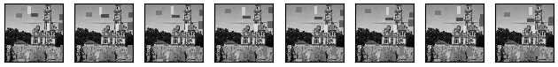
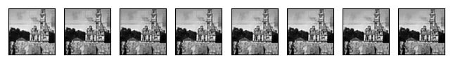
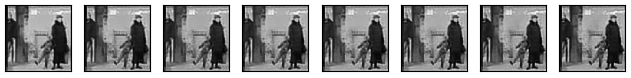
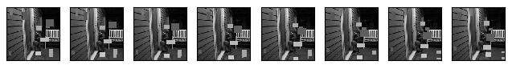
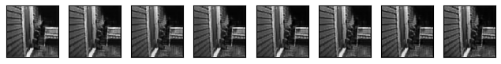
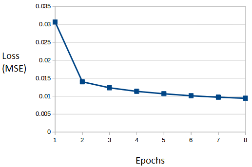

# Video-Inpainting
Video Inpainting using 3D Convolutional Neural Network autoencoder

### How to run?

1. Download Dataset

   Download required dataset and copy it into the folder name 'src-images'

2. Download the python libraries provided in requirements.txt file

   `pip2 install --user -r requirements.txt`

   Note: Keras uses Tensorflow-gpu backend

3. Preprocess the dataset
   
   Run the program `create_dataset.py`. Change parameters as required.
   
   Default parameters: 50 images -- 50 video_frames -- 50 mini-batches.
   
   The console will print out progress during the creation of the synthetic data.

4. Train and test the neural network
   
   To run the training and testing of the neural network provided, access the python 
   files `train.py` and `test.py`, change parameters as required and run them. 

### Images

Generated frames of color video with moving objects:

Grayscaled frames of video to form the dataset:

Ground truth video frames:

#### Result

Input - Output:

Mean squared error (MSE) loss during training epochs:

